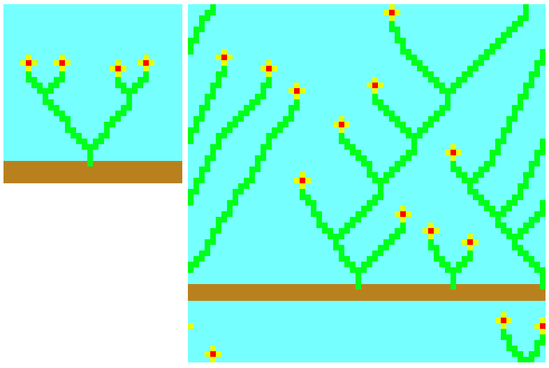
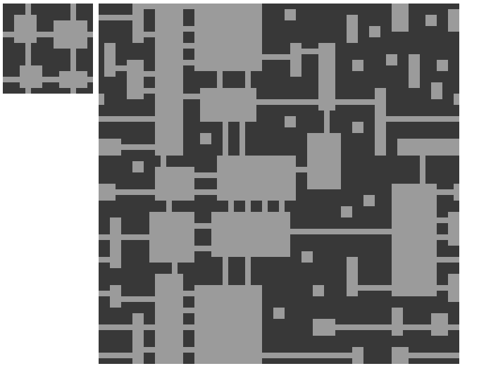
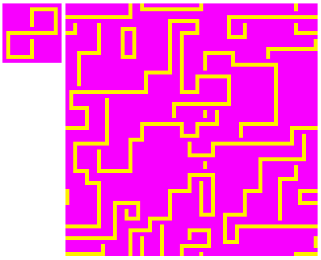

# Wave Function Collapse 

This is my attempt at recreating the 
[wave function collapse algorithm](https://github.com/mxgmn/WaveFunctionCollapse)
in Rust, however this implementation is not particularly fast or optimized at
the moment.

This implementation wraps the input and output image at the edges.

## Examples




## Compile and Run
```
cargo build --release
cargo run --release images/inputimage1.png
```

Dependencies: SDL2

## Helpful resources

These are some sources that I found helpful when researching how to implement
the algorithm.

 - [The original Wave Function Collapse repo by mxgmn](https://github.com/mxgmn/WaveFunctionCollapse)
 - [Another implementation of WFC in python](https://github.com/avihuxp/WaveFunctionCollapse)
 - [libwfc](https://github.com/vplesko/libwfc)
 - [A blogpost on gridbugs.org on wave function collapse](https://www.gridbugs.org/wave-function-collapse/)
 - [A very useful paper on wave function collapse](https://adamsmith.as/papers/wfc_is_constraint_solving_in_the_wild.pdf)
